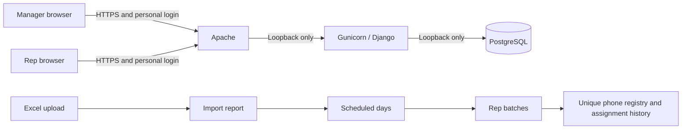

# Architecture and access rules

The application uses Django for sessions, authorization, forms, server-rendered pages, and transactional database operations. PostgreSQL is the production source of truth. JavaScript adds upload interaction, the previously-uploaded-numbers dialog, instant appearance switching, and screen privacy behavior; client-side controls never grant access. The appearance (dark, light or system) is a `phonetracker_theme` cookie set by `POST /appearance/`, which is CSRF-protected, open to signed-out visitors, writes no audit event and stores nothing else; the context processor renders it into `<html data-theme>`.

## Import and allocation

Numbers are normalized before comparison, so punctuation or a leading country code cannot create a new contact. A permanent unique phone registry prevents a later upload from resetting an existing number. Import rows retain their result, including prior-upload warnings and invalid data. The spreadsheet is not published as a downloadable file.

Every new upload has a required GFS Texting (Donut) or Ringcentral Texting (Clean) type. RepListMembership stores each account's eligibility; one rep can belong to both groups. Allocation happens after validation and exclusion. An upload is split among the selected dates; each day's allocation is then divided among selected active group members. Both preview and publication validate membership on the server, including retries. Membership changes use the same PostgreSQL transaction lock as allocation. When a count is uneven, extra rows are distributed deterministically. Every new phone is reserved once, including phones scheduled for future dates. The unique registry spans both list types. A number has at most one live assignment: when a manager chooses to upload previously uploaded numbers again, publication marks their earlier live assignments as assigned again before creating the new ones, in the same locked transaction. Earlier lists keep their rows.

The application has two meanings of access:

- A manager can review imports, create batches, manage reps, view history, and clear lists.
- A rep can read phone numbers only from their own batches for today while still belonging to the upload's texting group. The weekly calendar shows only their own schedule metadata (title, type, date, count), including upcoming dates. The date is computed on the server in the configured company timezone. Future, past, and cleared phone lists are inaccessible. URLs are not credentials, and knowing another batch's identifier grants no access.

Lists are delivered through each rep's own dashboard and calendar; no link needs to be shared. List URLs contain batch identifiers only, never a password, login token, or phone number.

## Read-only lists, clearing, and history

Reps receive read-only lists of phone numbers. There are no call-start, interest, or outcome controls. Assignment means a number was allocated to a rep, not that the rep contacted it. The interface does not display call metrics or completion progress.

Previously uploaded numbers are flagged in the import report. A draft containing them cannot be split until the manager answers whether to upload them again (ImportBatch.include_previous); No excludes them and Yes includes them. Legacy do-not-contact numbers are never reused. Clearing, date expiry, and reuploading never reassign existing numbers on their own.

Clearing a batch ends rep access to that batch. Clearing an upload ends rep access to all of its batches, including future dates. Already-open pages hide their list when their status check detects the change; subsequent server requests deny access immediately. Clearing preserves uploads, phone history, assignments, and actor/timestamp audit records. It cannot retract information a rep has already seen.

Earlier versions may contain call or outcome records. Those records remain historical data. They do not give a rep access to a cleared or expired batch, including when an old assignment was marked in progress. The current application does not create or complete calls.

## Trust boundaries

Apache accepts HTTPS requests from the configured private subnet, overwrites proxy headers, and forwards only to loopback Gunicorn. PostgreSQL also listens only on loopback. The application verifies authentication, role, ownership, and dates on the server rather than depending on hidden buttons or client-side time.

Rep responses contain only that rep's schedule metadata and, on authorized list pages, phone numbers available today. Authenticated pages use cache restrictions; password/session protections apply in production. Removing membership or disabling an account revokes access on subsequent requests and invalidates displayed batches on their next status check. Privacy blur and watermarks are deterrents. They cannot provide screenshot prevention or control another application, operating-system capture, or a camera.

Accounts and password resets are administrator-managed. A rep cannot access either the account-management endpoints or Django's self-service password-change endpoints. Generated secrets use Python's secrets module and Django's password hashing; plaintext exists only in the immediate admin response or initial private provisioning file. Resetting a password invalidates prior authenticated sessions. Successful sign-in events record the actor and timestamp; the admin account page shows these events to the second in the company timezone. Merely viewing an account or an active session is not logged as another sign-in.

Audit events support operational accountability, but database administrators can change the database. This is not a tamper-proof compliance archive. Administrative OS/database access should be limited and backups retained under the company's data-retention policy.

## Validation before real use

The production release gate includes authentication/role checks, another rep's direct URL access, future/past-date bypass attempts, normalized reuploads, simultaneous allocation, read-only rep lists, and clearing a batch while its page is open. Verify that legacy in-progress records grant no exception to date or clear restrictions and that old call-action endpoints cannot mutate data. Use PostgreSQL for concurrent tests. Verify HTTPS, static assets, cookies, logs, backup restoration, and service restart on the actual Mac mini before uploading live phone lists.

## Weekly templates

ScheduleTemplate and TemplateList (tracker/planning.py) describe a repeating week: each planned list has a name, texting group, weekdays and reps. Drafting from past weeks groups the last four weeks of published, uncleared uploads by name and texting group, comparing names by letters and digits only so spacing, capitals and punctuation variations match, copies the most recent week's weekdays and still-eligible reps, and records how many weeks used it. The draft starts off; nothing plans the calendar until a manager turns it on. Active templates add planned entries to the manager calendar for remaining days only. An upload started from a planned entry stores its template list and week, which pre-fills the split form; membership, dates and every other rule are still validated when the lists are created. The same list (by name and group) in several active templates is planned once per day, and each planned day is satisfied only by an open batch on that day, from an upload linked to that list or a published list with a matching name and group. A PlanSkip (name key, group, day) hides one planned day for every active template until it is undone; the split for another upload of the same list pre-fills only days that are neither covered nor skipped. Opening an upload link for a list that already has a file that week shows a warning naming the existing upload. Planned entries are calculated when the page is shown and are never visible to reps.

## Texting lists

TextingList (tracker/texting_lists.py) is the admin-managed registry of lists such as GFS and Ringcentral. Uploads, memberships, template lists and plan skips store a list's immutable key, so renaming relabels history without rewriting it; the two original lists keep the keys gfs and ringcentral. Keys are validated in the service layer: new uploads, templates and memberships accept only visible (active) lists, while existing work on a hidden list keeps working (including splitting a draft uploaded before the list was hidden) and hidden-list memberships survive rep edits. Saving a list’s reps changes only active reps; a disabled rep keeps their memberships so re-enabling restores their access. A list can be deleted only when nothing references it; removing a rep from a list immediately ends their access to that list's batches. Labels are read at most once per request (TextingListMiddleware).

